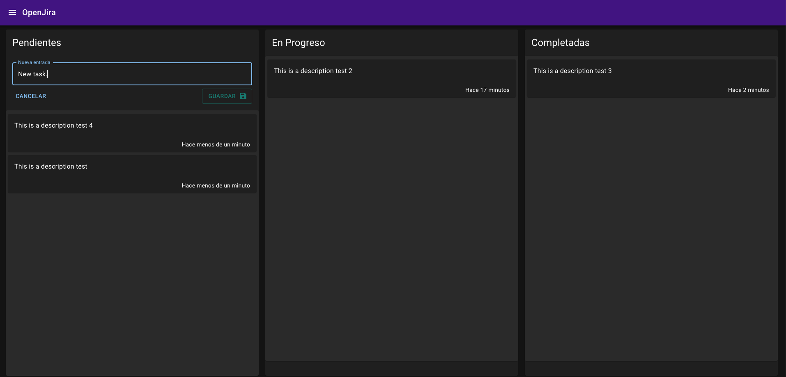
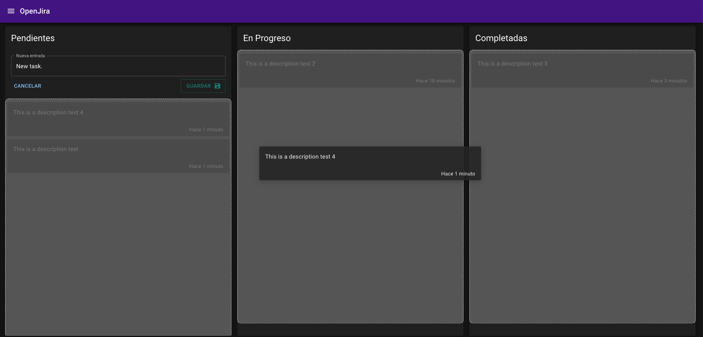
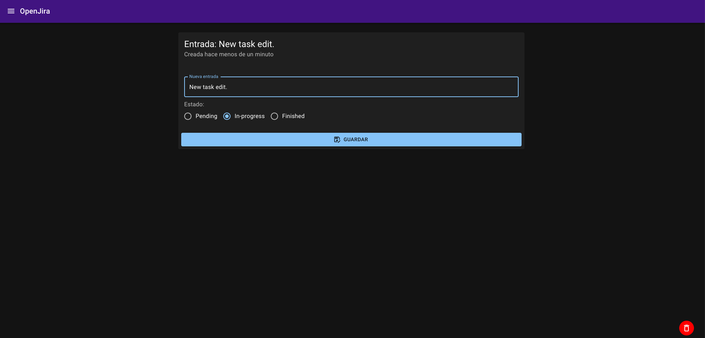

# Next Js OpenJira App

## Project description





```
This is a clone of jira task manager app, in wich I use Next js to build this project, the purpose of this project is
practice and study the concepts of SSR (server side rendering) that Next offer us.

PD. if you find at error send me a PR with the issue. =)
```

## Getting Started

To run the project in development mode you need the database, run this command.
(You need Docker)
```
docker-compose up -d
```

Rename the template.env to .env and set MONGO_URL variable with
```
MONGO_URL=mongodb://localhost:27017/entriesdb
```

* Install all packages and run in development mode with the follow commands.
```
yarn install
yarn dev
```

Open [http://localhost:3000](http://localhost:3000) with your browser to see the result.

## RESET AND FILL DATA BASE
call the endpoint:
```
  localhost:3000/api/seed
```

## TEST
The project is tested with jest and react-testing-library. To run the tests, just need to execute the next comand.
```
yarn jest
```